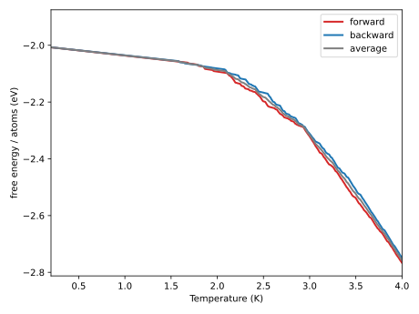
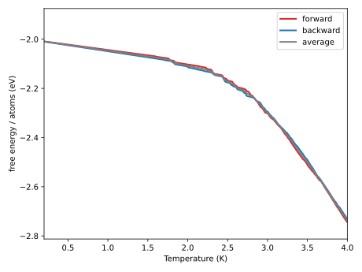
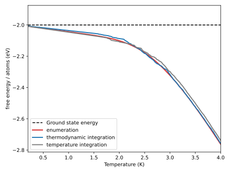

.. _example_free_energy_canonical_ensembles:
.. highlight:: python
.. index::
   single: Examples; Thermodynamic-integration and temperature-integration simulations

Thermodynamic-integration and temperature-integration simulations
=================================================================

This example illustrates how to carry out Thermodynamic-Integration (TI) and Temperature-Integration (TEI) simulations with :program:`icet` in the canonical ensemble. 
The TI method allows you to calculate the free energy at a given temperature for a system, whereas the TEI approach allows you to compute the change in free energy as a function of temperature.

Background
----------
Thermodynamic integration is used to estimate the free energy between two given Hamiltonians, :math:`H_A` and :math:`H_B`.
This is carried out by integrating along a thermodynamic path between the two Hamiltonians.
The free energy, F, of system B at temperature :math:`T_0` is given by,

   .. math::

      F_B = F_A + \int_0^1 \left\langle\frac{\mathrm{d}H(\lambda)}
      {\mathrm{d}\lambda}\right\rangle_{H} \mathrm{d}\lambda

where :math:`H(\lambda) = (1 - \lambda) H_A + \lambda H_B`.

Hence, if we chose :math:`H_A` in such a way that its free energy is known, then we can then calculate the free energy of our system of interest, :math:`H_B`.
A good choice is :math:`H_A = 0` which corresponds to a completely disordered system with free energy directly proportional to the ideal mixing entropy, which is analytically known,

   .. math::
      
      S_{\text{ideal}} = k_B\ln{\Omega},

where :math:`\Omega` is the multiplicity, the total number of states.

This choice of :math:`H_A = 0` also allows us to extract the temperature dependence of the free energy, :math:`F_B(T)`.
This can be done from the following relations, for more details see [FreAstKon16]_,

    .. math::
        F_B(T) =  \frac{1}{\lambda} \left ( - T_{0} S_{\text{ideal}} + \int_0^\lambda \left\langle\frac{\mathrm{d}H(\lambda)} {\mathrm{d}\lambda}\right\rangle_{H} \mathrm{d}\lambda \right )

where the temperature T is

    .. math::
        T = \frac{T_{0}}{\lambda}

We will also introduce temperature integration, which is a similar formulation to calculate the free energy.
This requires a reference free energy, which can be obtained from e.g., thermodynamic integration or from the ideal mixing entropy in the high temperature limit.
If this reference is known we can calculate the free energy as a function of temperature using the internal energy, U(T),

   .. math::
      \frac{F(T_2)}{T_2} = \frac{F(T_1)}{T_1} - \int_{T_1}^{T_2}\frac{U(T)}{T^2}\mathrm{d}T

2D Ising model
--------------

The `two-dimensional Ising model
<https://en.wikipedia.org/wiki/Ising_model#Two_dimensions>`_ is well suited
for demonstrating the TI and TEI algorithm and has been studied in the previous
:ref:`Wang-Landau simulation <example_wang_landau_simulations>` tutorial as well as references
therein .

We use the same setup as in the Wang-Landau example here.
The following code generates a cluster expansion that represents the 2D Ising
model.

.. literalinclude:: ../../../examples/advanced_topics/free_energy_canonical_ensemble.py
   :start-after: # Prepare cluster expansion
   :end-before: # Prepare initial configuration

For computational convenience, we consider a very small system of only
:math:`4\times4 = 16` sites and we setup the calculator together with some parameters.

.. literalinclude:: ../../../examples/advanced_topics/free_energy_canonical_ensemble.py
   :start-after: # Prepare initial configuration
   :end-before: ########################

Running a TI simulation
-----------------------

We run an equilibration using the :class:`CanonicalEnsemble <mchammer.ensembles.CanonicalEnsemble>`
to get a reasonable starting structure at high temperatures for the thermodynamic integration.

.. literalinclude:: ../../../examples/advanced_topics/free_energy_canonical_ensemble.py
   :start-after: # Prepare for the TI by running the canonical ensemble at a high temperature.
   :end-before: # Run the TI from the disordered to the ordered system.

We now want to sample the configurational space on the path between the two Hamiltonians,
i.e., on the path :math:`\lambda \in [0,1]`, this sampling is carried out by
:class:`ThermodynamicIntegrationEnsemble <mchammer.ensembles.ThermodynamicIntegrationEnsemble>`.
Note that we set the ``ensemble_data_write_interval`` to 1, this is to get the free energy
for as many temperatures as possible, but it is also to increase the accuracy of the integration later on.
Although, keep in mind that it is likely not necessary to have it as tightly sampled in the general case.
The integral is then calculated in :func:`get_free_energy_thermodynamic_integration
<mchammer.free_energy_tools.get_free_energy_thermodynamic_integration>`.
We set ``forward`` to ``True`` to indicate that we are going from :math:`H_A` to :math:`H_B`

.. literalinclude:: ../../../examples/advanced_topics/free_energy_canonical_ensemble.py
   :start-after: # Run the TI from the disordered to the ordered system.
   :end-before: # Prepare for the TI by running the canonical ensemble at a low temperature.

We then proceed to do the same thing but in the opposite direction. This should decrease
the statistical error. ``forward`` set to ``False`` indicates that we are going from :math:`H_B`
to :math:`H_A`

.. literalinclude:: ../../../examples/advanced_topics/free_energy_canonical_ensemble.py
   :start-after: # Prepare for the TI by running the canonical ensemble at a low temperature.
   :end-before: # The best approximation for TI is now given by the average of the two runs

The average between the two runs is then our result for the free energy

.. literalinclude:: ../../../examples/advanced_topics/free_energy_canonical_ensemble.py
   :start-after: # The best approximation for TI is now given by the average of the two runs
   :end-before: ##########################

Running a TEI simulation
------------------------

We can also compare with temperature integration. The procedure is very similar to the thermodynamic
integration.

As previously state we need the free energy at one of the endpoints, in this example
we will use the high temperature limit, i.e., the ideal mixing entropy. This should be a good
approximation for a high enough reference temperature. This means that the ``temperature_max`` will
will be assumed to large enough for the system to be completely disordered and :math:`TS_B \ggg U(T)`.

Start by running a :class:`CanonicalAnnealing <mchammer.ensembles.CanonicalAnnealing>`
simulation from high to low temperature. We start from an equilibrated structure obtained from a
:class:`CanonicalEnsemble <mchammer.ensembles.CanonicalEnsemble>` simulation at a high
temperature.

Note that we set the ``ensemble_data_write_interval`` to 1 again, with the same justification here as
for the TI simulation.

We can then extract the temperature dependence of the free energy from the canonical annealing as
outlined above. The integral is calculated in :func:`get_free_energy_temperature_integration
<mchammer.free_energy_tools.get_free_energy_temperature_integration>`. Where ``forward`` set to
True indicates that we are going from high to low temperature.
   
.. literalinclude:: ../../../examples/advanced_topics/free_energy_canonical_ensemble.py
   :start-after: # Prepare for the temperature integration by running the canonical ensemble at a high temperature.
   :end-before: # Prepare for the temperature integration by running the canonical ensemble at a low temperature.

We do the same thing but in the opposite direction now and calculate the free energy as an average
between the two runs from low to high and high to low temperature. Again, ``forward`` set to
False indicates that we are going from low to high temperature.

.. literalinclude:: ../../../examples/advanced_topics/free_energy_canonical_ensemble.py
   :start-after: # Prepare for the temperature integration by running the canonical ensemble at a low temperature.
   :end-before: # The best approximation for TEI is now given by the average of the two runs

The average between the two runs is then our result for the free energy

.. literalinclude:: ../../../examples/advanced_topics/free_energy_canonical_ensemble.py
   :start-after: # The best approximation for TEI is now given by the average of the two runs
   :end-before: ###########################

Comparing with the analytical solution
--------------------------------------

We can then compare the two methods with the analytical solution. The analytical solution
is obtained by directly calculating the partition function. This is possible for a small
configuration space when we can enumerate all possible structures.

Source code
-----------

.. container:: toggle

    .. container:: header

       The complete source code is available in
       ``examples/free_energy_canonical_ensemble.py``

    .. literalinclude:: ../../../examples/advanced_topics/free_energy_canonical_ensemble.py
