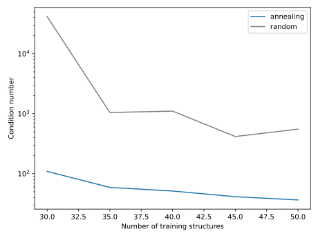

.. _training_set_generation:
.. highlight:: python
.. index::
   single: Examples; Generate training structures

Generating training structures
==============================
Here, we will introduce one way of generating a pool of structures that can be used for training.
There are of course more ways of doing this, for example, the structure enumeration introduced above.
However, this should be a robust way of generating your training structures and it will work even for systems with large primitive cells for which, e.g., enumeration will fail.

The idea behind this structure generation scheme is to from a large pool of randomized structures select a small subset with fixed number of structures which minimizes the condition number.
In order to select the subset of structures a Markov chain-Monte Carlo (MCMC) scheme is employed where structures are swapped in and out of the training set using the change in metric as acceptance criteria.
The effective temperature in the MC simulation is lowered in a simulated annealing fashion in order to obtain the optimal subset of structures.
This structure selection approach can, e.g., help with large condition number warnings obtained in the training procedure.

If you, however, have linearly dependent parameters, this could be if you, e.g., have a concentration restriction that makes one atomic type depend on another.
Then, this algorithm will fail since the condition number will always be infinite for a system with linearly dependent samples.
However, this could easily be fixed by merging the two linearly dependent orbits, see, :func:`merge_orbits
<icet.ClusterSpace.merge_orbits>`.

Import modules
--------------
The :func:`structure_selection_annealing <icet.tools.training_set_generation.structure_selection_annealing>`,
:func:`occupy_structure_randomly <icet.tools.structure_generation.occupy_structure_randomly>` and 
:func:`ClusterSpace <icet.ClusterSpace>` functions need to be imported together with some
additional functions from `ase <https://wiki.fysik.dtu.dk/ase>`_ and
`numpy <https://numpy.org/doc/>`_.

.. literalinclude:: ../../../examples/advanced_topics/training_set_generation.py
   :start-after:  # Import modules
   :end-before:   # For plotting

Set up the cluster space
------------------------
First, you need to select cutoffs. This can be difficult
if you do not have any prior knowledge of the system. However, if the you realize after
the first training iteration that the cutoffs were not sufficiently long
you can easily append more structure by repeating the process with
longer cutoffs.

.. literalinclude:: ../../../examples/advanced_topics/training_set_generation.py
   :start-after: # The possible occupations
   :end-before:  # Create a random structure pool

Generate a pool of random structures
------------------------------------
Next, we are going to generate a pool of random structures that is used in the annealing process.
Random structures can be generated in multiple different ways, with, e.g., respect to which supercells to consider, which distribution of concentration to draw from etc.
Here, we simply repeat the primitive face-centered cubic (FCC) cell with 3 random integers, such that the number of atoms in a given cell is smaller than 50. Next, a concentration is randomly drawn from a uniform distribution between 0 and 1, and the supercell is randomly occupied in accordance with the concentration.

.. literalinclude:: ../../../examples/advanced_topics/training_set_generation.py
   :start-after: # Create a random structure pool
   :end-before:  # We want to add

Note there are multiple ways in which one can generate randomized structures and which methods work depends on your system. Here, we use a very simple approach.

.. literalinclude:: ../../../examples/advanced_topics/training_set_generation.py
   :start-after: # Convenience function for supercell size generation
   :end-before:  # Create the primitive

Running the structure annealing
-------------------------------
We are now going to run the annealing procedure.

.. literalinclude:: ../../../examples/advanced_topics/training_set_generation.py
   :start-after: # Create a random structure pool
   :end-before:  # We want to add

Then you can collect the training structures like so

.. literalinclude:: ../../../examples/advanced_topics/training_set_generation.py
   :start-after: # Collect the structures that were found
   :end-before:  # Plot the metric

It is instructive to plot the condition number as a function of the accepted trial steps, to see benefit of the MCMC selection approach compared to just randomly selecting structure.
This is particularly clear for small number of structures in the training set for which randomized selection yields a `1e16` condition number (i.e. a ill-conditioned linear problem), whereas the MCMC selection generates a reasonable condition number.

 .. figure::
    _static/training_set_generation_cond_traj.svg

We can also compare the condition number for a random selection of structure.
This is taken as the start of
the metric trajectory, since if no starting indices is given the structures are randomly drawn
from the structure pool::

  ==================== Condition number for annealing and random structures ====================
  annealing structures: 31.17173090869272
  random structures: 226.45827088170168

Here, we compare the condition number for random structures and those generated by the annealing approach as a function of number of training structures.

Source code
-----------

.. container:: toggle

    .. container:: header

       The complete source code is available in
       ``examples/training_set_generation.py``

    .. literalinclude:: ../../../examples/advanced_topics/training_set_generation.py

.. container:: toggle

    .. container:: header

       You can use this method even if you already have a set of training structures,
       e.g., if you do the procedure iterativley.
       ``examples/training_set_generation_with_base.py``

    .. literalinclude:: ../../../examples/advanced_topics/training_set_generation_with_base.py
