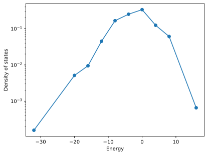
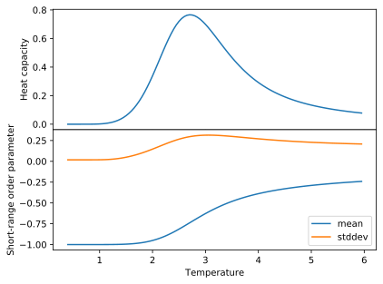
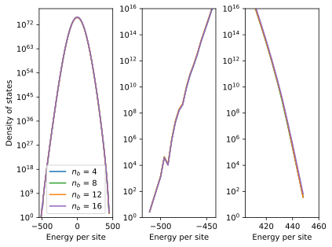
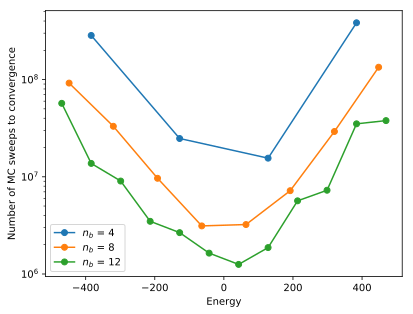
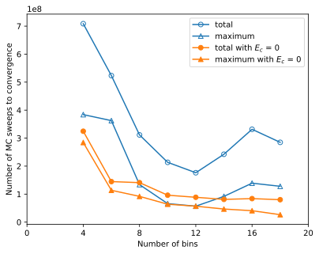
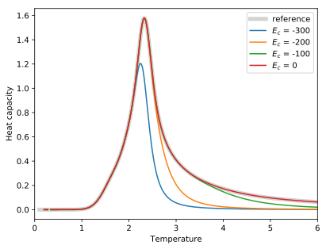

.. _example_wang_landau_simulations:
.. highlight:: python
.. index::
   single: Examples; Wang-Landau simulations

Wang-Landau simulations
=======================

This example illustrates how to carry out `Wang-Landau (WL)
<https://en.wikipedia.org/wiki/Wang_and_Landau_algorithm>`_ simulations with
:program:`icet`. Compared to :term:`Monte Carlo (MC) <MC>` simulations in
conventional thermodynamic ensembles there are a few differences to be aware
of. It is therefore strongly recommended to work through this entire example
before running your own :term:`WL` simulations.

Background
----------

When sampling a thermodynamic ensemble, say the canonical or semi-grand
canonical ones, one conducts :term:`MC` simulations at a given temperature,
commonly in order to gather thermodynamic averages of some observables. In
order to obtain the temperature dependence of these quantities one has to
conduct a series of simulations at different temperatures. In particular in
the vicinity of continuous phase transitions these simulations can become
tedious or close to impossible to converge.

Here, the :term:`WL` algorithm provides an alternative approach. It allows one
to extract the microcanonical density of states, from which many other
thermodynamic quantities can be calculated [WanLan01a]_ [LanTsaExl04]_.
Usually the :term:`density of states (DOS) <DOS>` is acquired as a function of
the energy. To this end, the :term:`WL` algorithm accumulates both the
microcanonical entropy :math:`S(E)` and a histogram :math:`H(E)` on an energy
grid with a predefined spacing (see argument ``energy_spacing`` of
:class:`WangLandauEnsemble <mchammer.ensembles.WangLandauEnsemble>`).

The algorithm is initialized as follows.

#. Generate an initial configuration.

#. Initialize counters for the microcanonical entropy :math:`S(E)` and the
   histogram :math:`H(E)` to zero.

#. Set the fill factor :math:`f=1`.

It then proceeds as follows.

#. Propose a new configuration (see argument ``trial_move`` of
   :class:`WangLandauEnsemble <mchammer.ensembles.WangLandauEnsemble>`).

#. Accept or reject the new configuration with probability

   .. math::

      P = \min \{ 1, \, \exp [ S(E_\mathrm{new}) - S(E_\mathrm{cur}) ] \},

   where :math:`E_\mathrm{cur}` and :math:`E_\mathrm{new}` are the energies of
   the current and new configurations, respectively.

#. Update the microcanonical entropy :math:`S(E)\leftarrow S(E) + f`
   and histogram :math:`H(E) \leftarrow H(E) + 1` where :math:`E` is
   the energy of the system at the end of the move.

#. Check the flatness of the histogram :math:`H(E)`. If
   :math:`H(E) > \chi \langle H(E)\rangle\,\forall E` reset the histogram
   :math:`H(E) = 0` and reduce the fill factor :math:`f \leftarrow f / 2`.
   The parameter :math:`\chi` is set via the argument ``flatness_limit`` of
   :class:`WangLandauEnsemble <mchammer.ensembles.WangLandauEnsemble>`.

#. If :math:`f` is smaller than a certain threshold (commonly between
   :math:`10^{-8}` and :math:`10^{-6}`, see argument ``fill_factor_limit``
   of :class:`WangLandauEnsemble <mchammer.ensembles.WangLandauEnsemble>`),
   terminate the loop, otherwise return to 1.

The microcanonical entropy :math:`S(E)` and the histogram along with related
information are written to the data container every time :math:`f` is updated.
Using the density :math:`\rho(E) = \exp S(E)` one can then readily compute
various thermodynamic quantities, including, e.g., the average energy:

.. math::

   \left<E\right>_T = \frac{\sum_E E \rho(E) \exp(-E / k_B T)}{
   \sum_E \rho(E) \exp(-E / k_B T)}

Similarly, it is also possible to compute averages and standard deviations of
any other observable in the data container.

2D Ising model
--------------

The `two-dimensional Ising model
<https://en.wikipedia.org/wiki/Ising_model#Two_dimensions>`_ is well suited
for demonstrating the utility of the :term:`WL` algorithm and has been
extensively studied in the literature [WanLan01a]_ [WanLan01b]_
[LanTsaExl04]_. The model exhibits a continuous phase transition, which occurs
at :math:`T_c = 2 J / k_B \ln (1 + \sqrt{2}) \approx 2.26919 J / k_B` in the
infinite system-size limit. In this example, we use the 2D Ising model as a
computationally inexpensive toy model.

The following code generates a cluster expansion that represents the 2D Ising
model. Here, Au and Ag are used as dummy species. Internally they are
represented by :math:`0` and :math:`1`, while in the Ising model the species
are represented by spins of :math:`+1` and :math:`-1`. The effective cluster
interaction for the first-nearest neighbor pair is therefore set to
:math:`J=2` (as opposed to :math:`J=1`). By means of this transformation the
energy/temperature scales remains invariant.

.. literalinclude:: ../../../../examples/advanced_topics/wang_landau/1_run_simulation.py
   :start-after: # Prepare cluster expansion
   :end-before: # Prepare initial configuration

Running a WL simulation
-----------------------

For computational convenience, we consider a very small system of only
:math:`4\times4 = 16` sites.

.. literalinclude:: ../../../../examples/advanced_topics/wang_landau/1_run_simulation.py
   :start-after: # Prepare initial configuration
   :end-before: # Set up WL simulation

A :term:`WL` simulation is set up similar to a thermodynamic ensemble.

.. literalinclude:: ../../../../examples/advanced_topics/wang_landau/1_run_simulation.py
   :start-after: # Set up WL simulation
   :end-before: # Add short-range order observer

In the case of this very simple model, the energy spectrum is discrete and the
choice of the energy spacing is straightforward (``energy_spacing=1``). While
for arbitrary CEs the energy spectrum is technically discrete it is
practically continuous and the choice of the energy spacing requires more
care, as illustrated below.

We also note that the intervals at which data is written to the data container
are set to 10 :term:`MCS` (``ensemble_data_write_interval``) and 100
:term:`MCS` (``trajectory_write_interval``. Often :term:`WL` simulations need
to be run for a considerable number of steps. It is not uncommon that one
requires on the order of 10 to 100 million :term:`MCS` (see below). As a
result, data containers can become quite large, which can lead to a notable
memory footprint and slow down analysis. It is therefore recommend to choose
the ``write_interval`` parameters not too small.

We also attach a short-range order observer in order to illustrate the
analysis of observables other than the energy:

.. literalinclude:: ../../../../examples/advanced_topics/wang_landau/1_run_simulation.py
   :start-after: # Add short-range order observer
   :end-before: # Run WL simulation

And then run the WL simulation for a number of :term:`MCS`:

.. literalinclude:: ../../../../examples/advanced_topics/wang_landau/1_run_simulation.py
   :start-after: # Run WL simulation

Analyzing a WL simulation
-------------------------

The data container file contains all the information that is needed for
extracting thermodynamic data from a :term:`WL` simulation. In addition to the
regular fields found in most data containers such as ``mctrial``,
``potential``, or ``acceptance_ratio``, a :term:`WL` data container contains
the fields ``fill_factor``, which is the current value of :math:`f`,
``histogram``, and ``entropy``. These data are not written at every step as
they consume quite a lot of space. Rather they are only added to the data
container when the fill factor :math:`f` is updated or the maximum number of
MC trial steps has been reached.

:program:`icet` provides support functions to make the analysis of these data
particularly simple. One can for example extract the (relative) entropy as
well as the :term:`DOS`.

.. literalinclude:: ../../../../examples/advanced_topics/wang_landau/2_analyze_simulation.py
   :start-after: # Get density and entropy
   :end-before: # Plot density

For the present, very small system, the number of energy bins is small and
the :term:`DOS` is relatively rough.

   Density of states from Wang-Landau simulation of :math:`4\times4`
   two-dimensional Ising model.

Availability of the :term:`DOS` enables one for example to compute the heat
capacity as a function of temperature using the following relations:

.. math::

   \left<E^n\right> = \frac{\sum_E E^n \rho(E) \exp(-E / k_B T)}{
   \sum_E \rho(E) \exp(-E / k_B T)} \\
   C_v = \left( \left<E^2\right> - \left<E\right>^2 \right) \Big/ k_B T^2

The mean and the standard deviation of the energy as well as thermodynamic
averages of other observables can be extracted using
:func:`get_average_observables_wl
<mchammer.data_containers.get_average_observables_wl>`:

.. literalinclude:: ../../../../examples/advanced_topics/wang_landau/2_analyze_simulation.py
   :start-after: # Compute thermodynamic
   :end-before: # Plot heat capacity

The heat capacity obtained using the :term:`WL` approach matches those from a
series of MC simulations in the canonical ensemble (not described here). The
availability of the full :term:`DOS` enables one, however, to extract the heat
capacity as a practically continuous function of temperature.

   Heat capacity (top) and short-range order parameter from Wang-Landau
   simulation of a :math:`4\times4` two-dimensional Ising model.

Using the same approach one can also extract thermodynamic averages of other
observables. This is illustrated here by the first-nearest neighbor
short-range order parameter. Notably the standard deviation of the latter
correlates with the heat capacity, corresponding to the increase (and for an
infinite system, divergence) of the correlation length at the transition
temperature.

Representative configurations
-----------------------------

In addition to common thermodynamic observables one can also be interested in
the evolution of the structure itself as a function of temperature. To this
end, :program:`icet` provides the :func:`get_average_cluster_vectors_wl
<mchammer.data_container.get_average_cluster_vectors_wl>` function, which
allows one to obtain the average cluster vectors at different temperatures:

.. literalinclude:: ../../../../examples/advanced_topics/wang_landau/3_extract_structures.py
   :start-after: # Get average cluster vectors
   :end-before: # Plot pair

The result shows a systematic variation of the pair term of the cluster vector
with temperature.

.. figure:: _static/wang_landau_cluster_vector.svg
   :width: 70%

   Pair term of the cluster vector of the average structure as a function of
   temperature.

Using the :func:`generate_target_structure
<icet.tools.structure_generation.generate_target_structure>` function, one can
then furthermore translate the cluster vector into a structure:

.. literalinclude:: ../../../../examples/advanced_topics/wang_landau/3_extract_structures.py
   :start-after: # Get low(est) energy structure

The generation of structures from cluster vectors is described in much more
detail in :ref:`this example <advanced_topics_sqs_structures>`.

Size-dependence of transition temperature
-----------------------------------------

For the system size considered above one obtains a critical temperature of
:math:`T_c(N=16) = 2.742 J / k_B`. This is still quite far off from the value
of :math:`T_c(N\rightarrow\infty) = 2.26919 J / k_B` that one obtains
analytically for the infinite-size limit. Using the :term:`WL` algorithm this
system size dependence can be explored rather efficiently.

.. figure:: _static/wang_landau_heat_capacity_size.svg
   :width: 70%

   Heat capacity from Wang-Landau simulations of the two-dimensional Ising
   model for different system sizes.

With increasing system size the peak in the heat capacity both sharpens and
shifts to the left, approaching the infinite-size limit in the expected
fashion.

Parallelizing Wang-Landau simulations
-------------------------------------

The larger the system, the wider the energy range, the larger the number of
bins. Moreover, in larger systems the ratio between maximum and minimum of the
:term:`DOS` increases as well. It therefore becomes increasingly tedious to
converge a :term:`WL` simulation. To combat this challenge one can split up
the energy range in multiple segments and sample each segment in a separate WL
simulation. After the algorithm has reached convergence for each segment, the
:term:`DOS` can be patched together. This approach has at least two crucial
advantages:

#. The extraction of the :term:`DOS` can be parallelized.

#. The number of steps required for converging one segment is smaller than the
   number of steps required to converge the :term:`DOS` without binning.

:program:`icet` allows one to run binned simulations by setting the
``energy_range_left`` and ``energy_range_right`` keyword arguments of the
:class:`WangLandauEnsemble <mchammer.ensembles.WangLandauEnsemble>` class.
For very small systems such as the one considered above, binning the energy
range is actually ineffective. The number of energy levels is simply too
small. To demonstrate the benefit of binning, here, we therefore show results
from a set of simulations for a system with :math:`16\times 16=256` sites.

Firstly, regardless of the number of bins one recovers the correct density of
states and heat capacity. The middle and right-hand panels below show distinct
features in the low-energy range, which correspond to the occurrence of
ordered structures.

   Density of states (left) and heat capacity (right) from binned :term:`WL`
   simulations for a :math:`16 \times 16` system using a varying number of
   bins :math:`n_b`.

The number of :term:`Monte Carlo sweeps (MCS) <MCS>` required to reach
convergence, here :math:`f<10^{-6}`, in a certain energy range, scales
inversely with the :term:`DOS` in the respective bin. The low and high-energy
regions therefore require a much larger number of :term:`MCSs` than the
central regions (see figure below). Moreover, the smaller the energy range
(and hence the smaller the number of distinct energies) the lower the number
of :term:`MCSs` required to achieve convergence.

   Number of :term:`MCSs` required to achieve convergence (:math:`f<10^{-6}`)
   as a function of energy from simulations using a varying number of bins
   :math:`n_b` (top) and number of bins (bottom) for a :math:`16 \times 16`
   system.

This demonstrates how binning can be beneficial not only since it allows for
parallelization but since a limited energy range can be sampled more quickly,
leading to faster convergence.

A further reduction of computational cost can be achieved by realizing that
one often does not require the :term:`DOS` to be converged in the entire
energy range. It is usually the low energy range that dominates under most
thermodynamically relevant conditions. Under such circumstances, it is thus
sufficient to only include bins up to a certain cutoff energy :math:`E_c`. In
the present case, this is illustrated for the heat capacity. Even if the
integration over the :term:`DOS` is cut off beyond :math:`E_c` one still
achieves very good agreement with the data obtained using the full energy
range up to a temperature of approximately 9 to 10.

   Heat capacity obtained by integrating over DOS only up to a certain cutoff
   energy :math:`E_c` for a :math:`16 \times 16` system.

This translates to a further reduction in the number of :term:`MCSs` required
for convergence (orange symbols in figure above). The data above suggest that
further optimization is possible by using an inhomogeneous distribution of bin
sizes with smaller/larger bin sizes at the boundaries/center of the energy
range.

Further tips
------------

It is a good idea to write the data container to file in regular intervals.
This can be achieved by setting the ``data_container_write_period`` keyword
argument of :class:`WangLandauEnsemble
<mchammer.ensembles.WangLandauEnsemble>`.

Simulations can be easily restarted by rerunning the original run script
provided a data container file has been written. In that case, the last state
of the simulation will be restored from the data container.

At the beginning of the simulation, the potential of the initial configuration
is not guaranteed to fall within the specified energy range. In that case, a
WL simulation over the entire energy range is carried out *until* the targeted
energy range has been reached. In order to shorten this initial
"equilibration" period, one can start the simulation from suitable
configurations. Since it easier to find high-density configurations, a
suitable approach is to start from known ground state (or very low energy)
configurations to sample the lower-energy region.

Source code
-----------

.. container:: toggle

    .. container:: header

       The complete source code is available in
       ``examples/1_run_simulation.py``

    .. literalinclude:: ../../../../examples/advanced_topics/wang_landau/1_run_simulation.py

.. container:: toggle

    .. container:: header

       The complete source code is available in
       ``examples/2_analyze_simulation.py``

    .. literalinclude:: ../../../../examples/advanced_topics/wang_landau/2_analyze_simulation.py

.. container:: toggle

    .. container:: header

       The complete source code is available in
       ``examples/3_extract_structures.py``

    .. literalinclude:: ../../../../examples/advanced_topics/wang_landau/3_extract_structures.py
