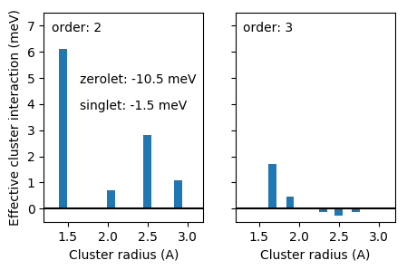

.. _tutorial_analyze_ecis:
.. highlight:: python
.. index::
   single: Tutorial; Analyze ECIs

Analyzing ECIs
==============

It is also of interest to consider the variation of the effective cluster
interactions (:term:`ECIs`) with distance and order. To this end, after
loading the cluster expansion constructed :ref:`previously
<tutorial_construct_cluster_expansion>` from file, we first organize the ECIs
into a dictionary.

.. literalinclude:: ../../../../tutorial/basic/4_analyze_ecis.py
   :start-after: # step 1
   :end-before: # step 2

Subsequently, the ECIs can be plotted.

.. literalinclude:: ../../../../tutorial/basic/4_analyze_ecis.py
   :start-after: # step 2

  Effective cluster interactions for second (pairs) and third (triplet) order
  clusters as a function of cluster radius.

Source code
-----------

.. container:: toggle

    .. container:: header

       The complete source code is available in
       ``tutorial/basic/4_analyze_ecis.py``

    .. literalinclude:: ../../../../tutorial/basic/4_analyze_ecis.py
