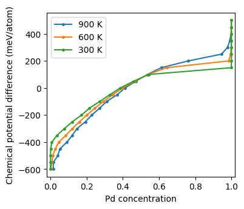
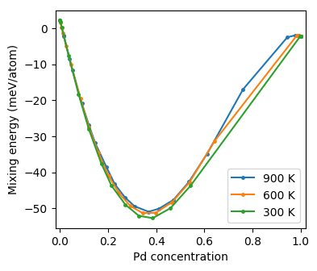
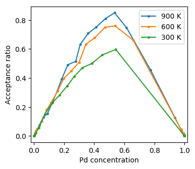

.. _tutorial_monte_carlo_analysis:
.. highlight:: python
.. index::
   single: Tutorial; Analyze Monte Carlo simulations

Analyze Monte Carlo simulations
===============================

After the :ref:`Monte Carlo simulations <tutorial_monte_carlo_simulations>`
have finished, they can be analyzed in various ways. It is convenient first to
collect all data in a convenient format.

.. literalinclude:: ../../../../tutorial/basic/6_analyze_monte_carlo.py
   :start-after: # step 1
   :end-before: # step 2

Now we can easily plot the chemical potential difference as a function of
composition. Here, we use a `pandas DataFrame object
<https://pandas.pydata.org/pandas-docs/stable/generated/pandas.DataFrame.html>`_,
which provides us with a very simple means to sort the data.

.. literalinclude:: ../../../../tutorial/basic/6_analyze_monte_carlo.py
   :start-after: # step 2
   :end-before: # step 3

  Chemical potential difference as a function of concentration from Monte Carlo
  simulations in the semi-grandcanonical ensemble.

In the resulting figure one observes a gap in the :math:`\Delta\mu` vs
composition plot at concentrations around 85% Pd, which indicates a very
assymmetric miscibility gap and in qualitative agreement with `experimental
assessments of the phase diagram
<http://resource.npl.co.uk/mtdata/phdiagrams/agpd.htm>`_. In the latter the
miscibility gap closes, however, already at just above 600 K. This quantitative
discrepancy can originate from a number of factors including, in approximately
decreasing order of importance, the exchange-correlation functional used in the
density functional theory calculations, the accuracy of the cluster expansion,
vibrational contributions, etc.

It can also be instructive to plot the mixing energy.

.. literalinclude:: ../../../../tutorial/basic/6_analyze_monte_carlo.py
   :start-after: # step 3
   :end-before: # step 4

  Mixing energy as a function of concentration from Monte Carlo simulations in
  the semi-grandcanonical ensemble.

Furthermore one might want to consider for example the acceptance rates.

.. literalinclude:: ../../../../tutorial/basic/6_analyze_monte_carlo.py
   :start-after: # step 4

  Acceptance ratio as a function of concentration from Monte Carlo simulations
  in the semi-grandcanonical ensemble.

As expected the acceptance rate increases with temperature and is maximal for
intermediate concentrations.

Source code
-----------

.. container:: toggle

    .. container:: header

       The complete source code is available in
       ``tutorial/basic/6_analyze_monte_carlo.py``

    .. literalinclude:: ../../../../tutorial/basic/6_analyze_monte_carlo.py
