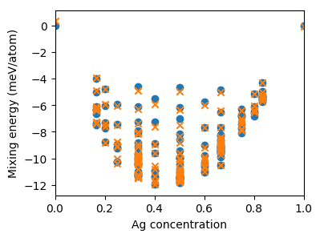

.. _tutorial_compare_to_target_data:
.. highlight:: python
.. index::
   single: Tutorial; Compare with target data

Comparison with target data
===========================

In this step the performance of the cluster expansion constructed in the
:ref:`previous step <tutorial_construct_cluster_expansion>` will be tested
against the target data. After loading the CE from file, we loop over all
configurations in the ``structures.db`` database and compile the silver
concentration as well as the target and predicted mixing energies into a list.
Note that the latter of the three values is calculated by calling the
:func:`ClusterExpansion.predict() <icet.ClusterExpansion.predict>` method with
the :class:`ASE Atoms <ase.Atoms>` object that represents the present structure
as input argument.

.. literalinclude:: ../../../../tutorial/basic/3_compare_to_target_data.py
   :start-after: # step 1
   :end-before: # step 2

Once the list is complete the predicted and target mixing
energies are plotted as functions of the concentration of silver atoms.

.. literalinclude:: ../../../../tutorial/basic/3_compare_to_target_data.py
   :start-after: # step 2

The figure generated by this diagram is shown below.

  Predicted (crosses) and target (open circles) mixing energies versus silver
  concentration for the structures used in the construction of the cluster
  expansion.

Source code
-----------

.. container:: toggle

    .. container:: header

       The complete source code is available in
       ``tutorial/basic/3_compare_to_target_data.py``

    .. literalinclude:: ../../../../tutorial/basic/3_compare_to_target_data.py
