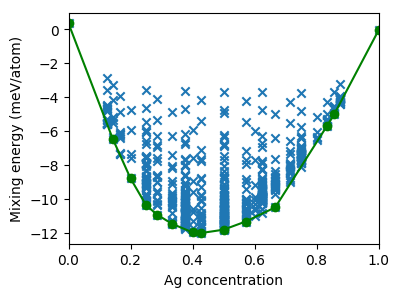

.. _tutorial_enumerate_structures:
.. highlight:: python
.. index::
   single: Tutorial; Enumerate structures

Enumerate structures
====================

Predict mixing energies
-----------------------

In this step the cluster expansion constructed :ref:`previously
<tutorial_construct_cluster_expansion>` will be employed to predict the mixing
energies for a much larger set of structures obtained by enumeration. After
loading the CE from file, we loop over all structures with up 8 atoms in the
unit cell and compile silver concentrations and predicted mixing energy into a
list, which is calculated by calling the :func:`ClusterExpansion.predict()
<icet.ClusterExpansion.predict>` method with the :class:`ASE Atoms <ase.Atoms>`
object that represents the present structure as input argument.

.. literalinclude:: ../../../../tutorial/basic/4_enumerate_structures.py
   :start-after: # step 1
   :end-before: # step 2

Extract convex hull
-------------------

Using the complete set of mixing energies we then generate the convex hull
using the :class:`ConvexHull <icet.tools.convex_hull.ConvexHull>` class.

.. literalinclude:: ../../../../tutorial/basic/4_enumerate_structures.py
   :start-after: # step 2
   :end-before: # step 3

Plot results
------------

The predicted energies are then plotted together with the convex hull as a
function of the concentration of silver atoms.

.. literalinclude:: ../../../../tutorial/basic/4_enumerate_structures.py
   :start-after: # step 3
   :end-before: # step 4

The figure generated by this diagram is shown below.

  Predicted mixing energies versus silver concentration for a set of
  systematically enumerated structures.

Filter for low energy structures
--------------------------------

The :class:`ConvexHull <icet.tools.convex_hull.ConvexHull>` class also provides some
convenience functions including e.g., the possibility to extract structures
that are within a certain distance of the convex hull.

.. literalinclude:: ../../../../tutorial/basic/4_enumerate_structures.py
   :start-after: # step 4

These structures can then be calculated for example using the reference method
of choice.

Source code
-----------

.. container:: toggle

    .. container:: header

       The complete source code is available in
       ``tutorial/basic/4_enumerate_structures.py``

    .. literalinclude:: ../../../../tutorial/basic/4_enumerate_structures.py
